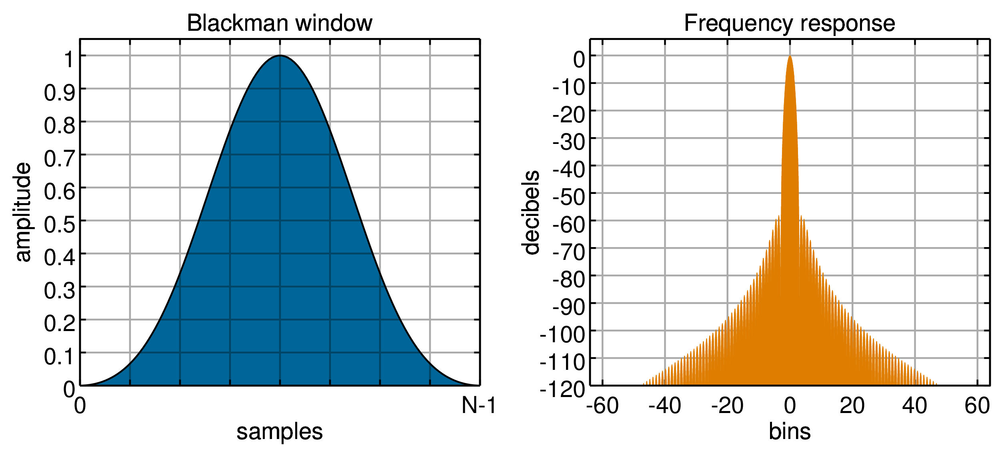
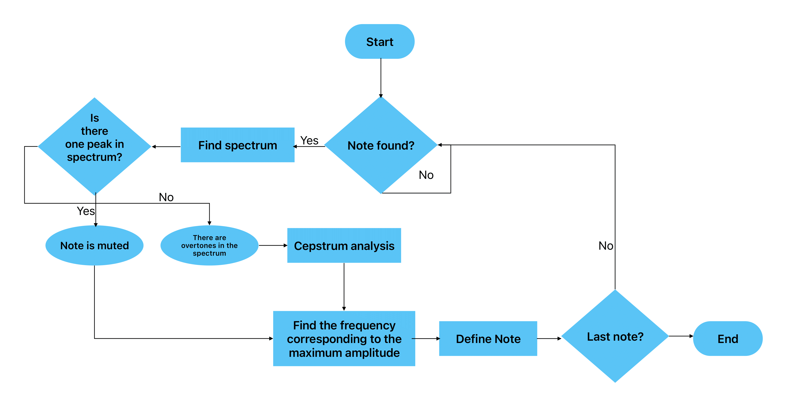
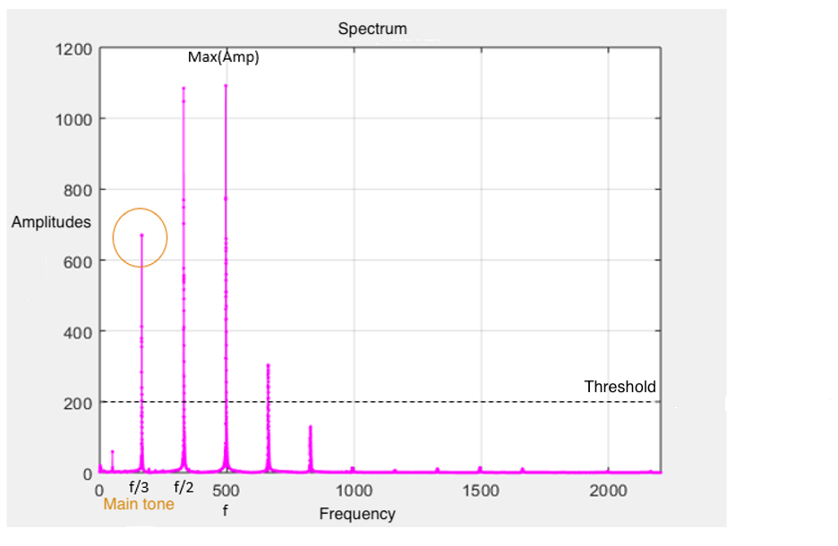
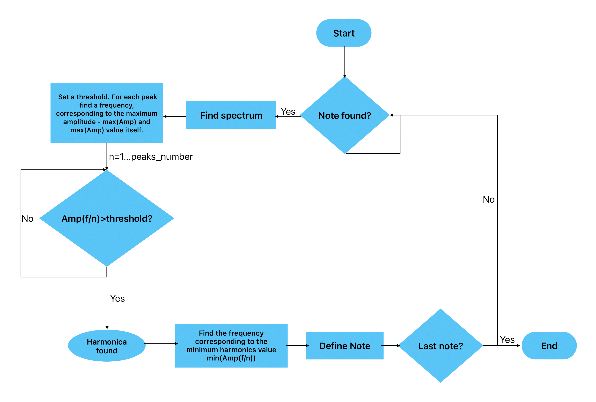

# Phonogram note analysis algorithm of a string musical instrument
The work is devoted to the implementation of an adaptive algorithm for phonogram note analysis, which can be considered as an intermediate step in the work of other algorithms. Test phonograms of musical instruments contain notes that differ greatly both in sound and in structure. In view of this, the suitable parameters are selected. 
The result of this work is the developed algorithms:
- Determination of the beginning and end of the sound of a note. 
- Definition of frequency of the basic tone of a sounding note on the basis of several methods.
- Note recognition.
The algorithms were tested on 15 phonograms of different complexity. The algorithms show a high accuracy of note detection, the minimum percentage of recognition - 75%.

## Theoretical Introduction
Most of the signals around us are difficult to express in the form of a simple mathematical formula, because over time the signal can become louder and quieter, can sound intermittent or constant. In this case the signal can be represented as a sum of simple basis functions φ(t). Then the original signal can be represented in the following form:
$$f(t)=\sum_{k=-∞}^∞c_kφ(t)$$
- f(t) – initial signal
- c_k – decomposition coefficient, depending on the signal f(t)
- φ(t) – chosen basis

### Fourier Transform (FFT)
In our case, we work with a string musical instrument. String oscillation can be represented as a sum of harmonic functions (sine and cosine), then the initial signal can be decomposed into a basis of orthogonal functions - sine and cosine. In general, the decomposition will have the following form:
$$f(t)=\sum_{k=-∞}^{+∞}c_ke^ikwt$$
- f(t) – initial signal
- t – time
- с_k – decomposition coefficient, depending on the signal f(t)
- kw – harmonic frequency
- e^ikwt – complex form of the sine and cosine record

This representation of the signal is called a Fourier series decomposition (Fourier Transform). 

### Discrete Fourier Transform (DFT)
For this work ase we will use Discrete Fourier Transform to obtain the spectrum of the signal as a set of numbers. This representation of the spectrum allows us to use computer power and the application of various methods for analysis.
Discrete Fourier Transform formula have the following form:
$$X_k=\sum_{n=0}^{N-1}x_ne^{(-2πi/N)kn}$$
- N - number of signal samples 
- n - discrete time value
- x_n – values of the signal samples, input parameter
- X_k – output data, complex amplitude values
- k - frequency index

Spectrum represented by a set of numbers can be analyzed using numerical methods. And in the spectrum of the signal there is information about the frequencies of the sounding notes. 
On top of that Matlab supports this transformation as well as lots of numerical methods for analysis

### Window Fourier Transform
The algorithm is based on the discrete Fourier transform described above. In order to show the dependence of the harmonic frequency of the original signal on time, some "Window" (window or weight function) is used. It runs through the whole time interval in such a way that for each time interval, the window function is applied:
$$W(n-m)$$
- n - array samples index
- m - sets the position of the window

This function is multiplied with each of the intervals, and can be applied with some overlap to each interval (for more accurate analysis). Subsequently, the Fourier transform for each interval is calculated. The result of multiplication is a complex vector of amplitudes corresponding to samples of the selected interval, which is written into a matrix and represents the magnitude and phase of each point in time and frequency.
In general, it looks like this:
$$X(m,w)=\sum_{n=-∞}^∞x[n]W(n-m)e^{-jwn}$$
- x[n] - array of samples
- W[n] - window function

The choice of window depends on the task and on the original signal. After all, by selecting some part of the signal with the window function, it is impossible to reproduce all the frequency characteristics on a given interval as accurately as possible. Window function creates spectral leaks - new frequencies appear that are not present in audio signal. You can minimize the number of leaks just by properly selecting the window function. For example, a simple rectangular window is ideal for sinusoids of comparable loudness, but you should not use this window for sinusoids with disparate amplitudes. The Blackman window is good for cases where high frequency spectrum leakage obscures low frequencies. These windows, in turn, do not handle noise well. The Henning window is the best option for analyzing almost periodic signals, which are the vibrations of strings.
Below are the above windows and their spectrums:

The only disadvantage of the Fourier window transform is that good frequency-time resolution cannot be achieved simultaneously in time and frequency. It is not possible to provide minimum distortion for both features. A wide window gives excellent representation in the frequency domain, while it is impossible to determine when the signal started and when it finished. On the other hand, a narrow window gives excellent representation in the time domain, while being poor in the frequency domain. The choice of window width is a compromise and depends on the task at hand and the problem being investigated.

### Cepstrum
To determine the fundamental frequency of a sounding note, spectrum analysis is often insufficient, especially for the analysis of phonograms of string instruments, as their spectrum contains a large number of overtones. The way out of this situation can be the analysis of the signal's Cepstrum. Cepstrum is the inverse of the DFT's logarithm  of the signal:

By calculating the spectrum of the signal, using the FFT, then calculating the logarithm of this spectrum, you can compress the dynamic range of the signal by reducing the amplitude difference in the harmonics. After applying an inverse DFT, the maximum amplitude will correspond to the frequency of the fundamental tone. Cepstral analysis is well suited for analyzing single notes with no more than one or two harmonics in the spectrum. With a larger number, the frequency accuracy will drop sharply.

## Algorithm Description
Matlab was chosen as the development environment, since this programm has a large number of pre-installed packages, including those suitable for the task. The preset methods used in the work are available in Matlab and have everything you need to accurately analyze a musical phonogram. For training purposes, you can use [Matlab online](https://matlab.mathworks.com/)

### Determining the beginning and end of a note
The first step of the algorithm is to digitize the recording and write it in an array of samples. The value of the reference determines the deviation of the string from the position of equilibrium at a certain point in time. After this operation we can begin to work with the data obtained. The array of samples is divided into equal intervals, each of which is multiplied by the selected window function of a fixed value. We will use a Henning window, consisting of 256 samples. After selecting the time intervals, a discrete Fourier transform is applied to each of them. As a result of these operations, a matrix 
$$|X(t,w)|$$ will be obtained, each column of which is a set of complex amplitudes for each time interval. Having plotted the matrix graph (spectrogram), we can clearly see that at the moments of note beginning, the complex amplitude module starts to increase sharply, and at the moments of note fading, the complex amplitude module value decreases strongly:

By selecting maxima in each column of the matrix |X(t,w)| we can set a threshold, a modulus value of the calculated amplitude, from which the beginning of the note sound will be determined. We can also set the threshold from which the end of the note will be determined. The values of amplitudes for different notes have no limits, so we will not be able to select the general threshold. The way out of this situation can be that the obtained array of complex amplitude modules can be normalized by limiting the values on some interval. As a result, any phonogram after the above mentioned transformations will be written to the array where the maximum value |X(t,w)| will correspond to 1, for example, and the minimum - 0. Now, knowing the minima and maxima of the signal and their correspondence to the sounding notes, we can trace the moments of the beginning and end of notes sounding. However, we should consider the fact that noise may be heard in the background of any recording, and it must be taken into account, otherwise, with a sufficiently low threshold set for the start of notes sounding, any noise will be perceived as a sounding note. For this purpose it is necessary to pass obtained values through the low-pass filter, then short sharp jumps of |X(t,w)| values will be smoothed by the filter:
$$A_{filter}^{max}=∑_{i=1}^NA_{max}*W_i$$

The algorithm for determining start and end of a note can be implemented as a finite automata:

- y[i] - one of the array maxima
- first threshold – note start
- second threshold – end of note

## Defining a sounding note
### Cepstrum analysis
When we find the moments of the beginning and the end of notes in the phonogram, we can find the values of the signal samples corresponding to these moments of time, and highlight single note. Then, for the selected note we can apply a DFT, and for the resulting set of complex amplitudes find the maximum among the amplitude modules, determining the frequency for the found amplitude. By comparing this frequency with the known set of frequencies of the tempered string, the note and octave can be determined. 
Meanwhile, stringed musical instruments has a large number of overtones, which will make it difficult to determine the fundamental frequency of the sounding note. To determine the fundamental frequency among the overtones, we can analyze not the spectrum of a particular note, but its cepstrum, which greatly reduces the influence of overtones and amplitude peaks in the search for the maximum. Experimentally, it was found that for muted-sounding notes, the Fourier transform is sufficient to determine the frequency, while the kepstra gives a more accurate representation for pure notes. The algorithm for determining the fundamental tone frequency:

### Harmonics analysis
Using cepstrum as a tool for determining the fundamental frequency is a low-cost operation, but this type of analysis is suitable for analyzing notes with few harmonics in their spectrum. A detailed harmonic analysis of the note spectrum is necessary for a more accurate determination of notes. 
It is known that the frequencies of the harmonics of one note are multiples of each other, this property can be used to identify the fundamental frequency, besides, in the same way you can determine how many harmonics of the fundamental frequency are present in the note.
The principle of the algorithm can be conveyed by the figure below:

The figure shows that the frequency multiple of the maximum amplitude frequency, which has the minimum value of the corresponding amplitude, will be the frequency of the main tone. And how many times the found frequency is less than the frequency of the maximum amplitude, determines the number of harmonics. The only thing that must be set for the correct operation of the algorithm is the threshold below which the search for amplitudes will not be performed, and the number that determines up to which harmonic will be analyzed. As practice shows, this number does not exceed 5.
We can represent the algorithm as follows:

### Best algorithm for specific case
Harmonic analysis is a more time-consuming algorithm, while the accuracy of determining the fundamental tone is much higher than with cepstral analysis. By combining the algorithms described above, we can get final algorithm:

